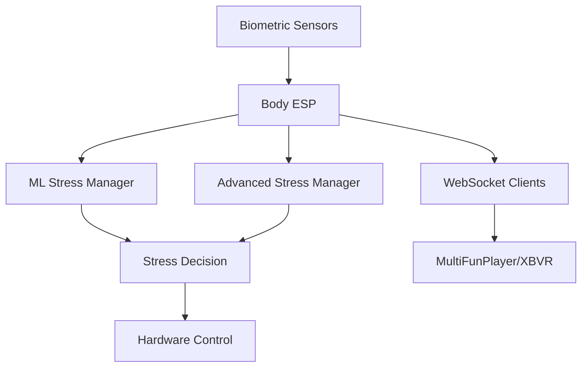
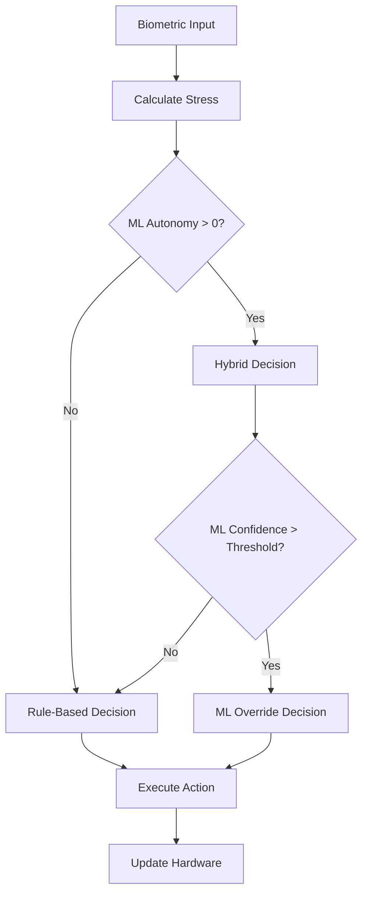

# Body ESP - Technical Documentation

  

Complete technical reference for Body ESP Biometric Stress Management System with Machine Learning integration.

## Table of Contents

- [🏗️ System Architecture](#️-system-architecture)
- [⚙️ Configuration Reference](#️-configuration-reference)
- [🧠 Machine Learning System](#-machine-learning-system)
- [🔧 Hardware Integration](#-hardware-integration)
- [📊 Development Guide](#-development-guide)
- [🔍 Debugging & Monitoring](#-debugging--monitoring)
- [🚀 Advanced Features](#-advanced-features)

---

## 🏗️ System Architecture

### Core Components



### File Structure

```
Body_ESP/
├── 📄 Body_ESP.ino                 # Main application
├── 📄 body_config.h                # Configuration system
├── 📄 advanced_stress_manager.h/cpp # ML-enhanced stress management
├── 📄 ml_stress_analyzer.h/cpp     # Machine learning engine
├── 📄 factory_reset.h/cpp          # Factory reset system
├── 📄 multifunplayer_client.h/cpp  # VR integration (optional)
├── 📄 overrule_view.h/cpp          # AI settings menu
├── 📄 menu_view.h/cpp              # Main menu system
└── 📄 input_touch.h                # Touch input handling
```

### Key Classes

| Class | Purpose | Key Features |
|-------|---------|--------------|
| `AdvancedStressManager` | Core ML stress management | 7-level system, ML autonomy, biometric analysis |
| `MLStressAnalyzer` | Machine learning engine | Pattern recognition, model storage, feature extraction |
| `MultiFunPlayerClient` | VR integration | WebSocket client, funscript enhancement |
| `FactoryReset` | System reset functionality | EEPROM wipe, configuration reset, ML data clearing |

---

## ⚙️ Configuration Reference

### Body Config Structure (`body_config.h`)

#### 🎛️ ML Autonomy Settings

```cpp
// ML AUTONOMY CONFIGURATION
float mlAutonomyLevel = 0.3f;        // 0.0-1.0: ML freedom level (30% default)
float mlOverrideConfidenceThreshold = 0.50f; // ML confidence for rule override
bool mlCanSkipLevels = true;         // ML can skip stress levels
bool mlCanIgnoreTimers = true;       // ML can ignore timers
bool mlCanEmergencyOverride = true;  // ML can make emergency decisions
```

**Configuration Guide:**
- `mlAutonomyLevel`: **Primary control** - how much freedom ML gets
  - `0.0` = Pure rule-based, no ML influence
  - `0.3` = ML advises, rules decide (recommended start)  
  - `0.5` = Balanced hybrid approach
  - `0.8` = ML has significant control
  - `1.0` = ML has full autonomy
- `mlOverrideConfidenceThreshold`: Minimum ML confidence to override rules
  - Lower = ML overrides more easily
  - Higher = ML needs more certainty
- `mlCanSkipLevels`: Allow ML to jump stress levels (e.g. 2→5)
- `mlCanIgnoreTimers`: Allow ML to change levels before timer expires

#### ⏱️ Stress Level Timing

```cpp
// STRESS LEVEL TIMINGS (Timer-based levels 0-3)
uint32_t stressLevel0Minutes = 5;    // Level 0: wait time in minutes
uint32_t stressLevel1Minutes = 3;    // Level 1: wait time in minutes  
uint32_t stressLevel2Minutes = 3;    // Level 2: wait time in minutes
uint32_t stressLevel3Minutes = 2;    // Level 3: wait time in minutes

// REACTIVE ZONE TIMINGS (Reaction-based levels 4-6)
uint32_t stressLevel4Seconds = 30;   // Level 4: reaction time in seconds
uint32_t stressLevel5Seconds = 20;   // Level 5: reaction time in seconds  
uint32_t stressLevel6Seconds = 15;   // Level 6: reaction time in seconds
```

**Tuning Guide:**
- **Shorter times** = More aggressive progression
- **Longer times** = More conservative approach
- **Level 7** has no timer (maximum mode)
- **Levels 4-6** are reactive (decisions based on biometric changes)

#### 🩺 Biometric Thresholds

```cpp
// SENSOR THRESHOLDS
float hrHighThreshold = 100.0f;      // High heart rate threshold (BPM)
float tempHighThreshold = 37.0f;     // High temperature threshold (°C)
float gsrHighThreshold = 1500.0f;    // High GSR threshold
float bioStressSensitivity = 1.0f;   // Biometric stress sensitivity multiplier
```

**Personalization:**
- Adjust thresholds based on individual baselines
- Higher sensitivity = more reactive to biometric changes
- Lower sensitivity = more stable, less reactive

#### 📈 Stress Change Detection

```cpp
// STRESS CHANGE DETECTION RATES (changes per minute)
float stressChangeRustig = 0.3f;     // Calm change rate
float stressChangeNormaal = 0.8f;    // Normal change rate
float stressChangeSnel = 1.5f;       // Fast change rate
float stressChangeHeelSnel = 3.0f;   // Very fast change rate
```

**Sensitivity Tuning:**
- Lower values = More sensitive to changes
- Higher values = Less sensitive, more stable
- Used for reactive decision making in levels 4-6

#### 🤖 ML Learning Parameters

```cpp
// ML LEARNING & ADAPTATION
float mlLearningRate = 0.1f;         // How fast ML adapts (0.0-1.0)
uint32_t mlMinSessionsBeforeAutonomy = 0; // Min sessions before autonomy (disabled)
float mlUserFeedbackWeight = 0.8f;   // Weight of user feedback in learning
```

---

## 🧠 Machine Learning System

### Stress Level System

```cpp
enum StressLevel : uint8_t {
  STRESS_0_NORMAAL = 0,      // Normal - no stress, speed 1
  STRESS_1_GEEN = 1,         // No/little stress, speed 2  
  STRESS_2_BEETJE = 2,       // Some stress, speed 3 + vibe/suction
  STRESS_3_IETS_MEER = 3,    // More stress, speed 4
  STRESS_4_GEMIDDELD = 4,    // Medium stress, speed 4-6 (reactive)
  STRESS_5_MEER = 5,         // More stress, speed 5-7 (reactive)  
  STRESS_6_VEEL = 6,         // High stress, speed 6-7 (reactive)
  STRESS_7_MAX = 7           // Maximum stress, everything MAX
};
```

### Decision Making Flow



### ML Autonomy Levels

| Autonomy % | Behavior | ML Influence |
|------------|----------|--------------|
| 0% | Pure rules | None - follows 7-level system exactly |
| 1-20% | Minor adjustments | Speed ±1, minor vibe/suction changes |
| 21-50% | Advisory mode | ML advises, rules decide final action |
| 51-80% | Hybrid mode | Weighted combination of ML + rules |
| 81-100% | ML dominant | ML can override rules, skip levels, ignore timers |

### Biometric Analysis

```cpp
struct BiometricData {
  float heartRate = 0.0f;      // BPM (50-200 range)
  float temperature = 0.0f;    // °C (35-40 range) 
  float gsrValue = 0.0f;       // GSR value (0-4095 range)
  uint32_t timestamp = 0;      // Measurement timestamp
};
```

**Feature Extraction:**
- Heart Rate Variability (HRV)
- Temperature trends and deltas  
- GSR trend analysis (rising/falling)
- Combined stress index calculation
- Historical pattern matching

### EEPROM Storage Layout

```
0x0000-0x3FFF: ML Model Storage (16KB)
0x4000-0x5FFF: Training Data Buffer (8KB) 
0x6000-0x6FFF: User Patterns/Config (4KB)
0x7000-0x7FFF: Session History (4KB)
```

---

## 🔧 Hardware Integration

### GPIO Assignments

```cpp
#define FACTORY_RESET_PIN    0     // Boot button (GPIO 0)
#define C_BUTTON_PIN         ?     // Emergency stop (user-defined)
#define SENSOR_I2C_SDA       21    // I2C data line
#define SENSOR_I2C_SCL       22    // I2C clock line
```

### I2C Device Map

| Address | Device | Purpose |
|---------|--------|---------|
| 0x50 | External EEPROM | Additional ML storage (optional) |
| 0x57 | DS3231 EEPROM | 32KB ML model/data storage |
| 0x68 | DS3231 RTC | Real-time clock |
| 0x76 | BME280 | Temperature/pressure sensor |

### Hardware Control Interface

```cpp
// Hardware control functions (implement in your hardware layer)
void setMotorSpeed(uint8_t speed);        // 1-7 speed control
void setMotorPosition(uint8_t position);  // 0-100 position
void setVibrator(bool active);            // Vibrator on/off
void setSuction(bool active);             // Suction on/off
```

---

## 📊 Development Guide

### Adding New Configuration Parameters

1. **Add to `body_config.h`:**
```cpp
struct BodyConfig {
  // ... existing config ...
  float myNewParameter = 1.0f;  // Add your parameter
};
```

2. **Add to Factory Reset:**
```cpp
void FactoryReset::resetSettings() {
  // ... existing resets ...
  BODY_CFG.myNewParameter = 1.0f;  // Reset to default
}
```

3. **Add to UI (if needed):**
```cpp
// In overrule_view.cpp - add new value line
drawValueLine(Y_POSITION, "My Param:", BODY_CFG.myNewParameter, MIN, MAX, STEP);
```

### Extending ML Decision Making

1. **Modify `makeHybridDecision()` in `advanced_stress_manager.cpp`:**
```cpp
StressDecision AdvancedStressManager::makeHybridDecision() {
  // ... existing logic ...
  
  // Add your custom ML logic here
  if (myCustomCondition) {
    enhanced.mlReasoning = "Custom ML decision";
    // ... custom behavior
  }
  
  return enhanced;
}
```

### Adding New Stress Actions

1. **Extend enum in `advanced_stress_manager.h`:**
```cpp
enum StressAction : uint8_t {
  // ... existing actions ...
  ACTION_MY_CUSTOM = 13,    // Add new action
};
```

2. **Handle in execution logic:**
```cpp
void executeStressAction(StressAction action) {
  switch(action) {
    // ... existing cases ...
    case ACTION_MY_CUSTOM:
      // Handle your custom action
      break;
  }
}
```

### Custom Sensor Integration

1. **Extend `BiometricData` structure:**
```cpp
struct BiometricData {
  // ... existing sensors ...
  float myCustomSensor = 0.0f;  // Add new sensor
};
```

2. **Update stress calculation:**
```cpp
float calculateBiometricStress(const BiometricData& data) {
  // ... existing calculation ...
  
  // Include your sensor in stress calculation
  float customStress = (data.myCustomSensor > threshold) ? 
                       (data.myCustomSensor - threshold) / scale : 0.0f;
  
  totalStress += customStress * weight;
  return totalStress;
}
```

---

## 🔍 Debugging & Monitoring

### Serial Output Tags

| Tag | Purpose | Example |
|-----|---------|---------|
| `[STRESS]` | Stress management decisions | `[STRESS] Level 3→2: ML Override (high confidence)` |
| `[ML]` | Machine learning operations | `[ML] Model prediction: Level 4, Confidence: 0.85` |
| `[MFP]` | MultiFunPlayer integration | `[MFP] Action: pos=75→60 speed=4 ML=50%` |
| `[RESET]` | Factory reset operations | `[RESET] EEPROM erase complete (100%)` |
| `[AI]` | AI settings changes | `[AI] ML Autonomy saved: 45.0%` |

### Debug Functions

```cpp
// Status monitoring
stressManager.printStatus();           // Complete stress manager status
factoryReset.printResetStatus();       // Factory reset status
mfpClient.printStatus();               // MultiFunPlayer client status

// Real-time monitoring
String status = stressManager.getStatusString();  // Quick status string
```

### Performance Monitoring

```cpp
// ML performance metrics
uint32_t totalPredictions = mlAnalyzer.getPredictionCount();
float avgProcessingTime = mlAnalyzer.getAverageProcessingTime();
float mlOverrideRate = mfpClient.getMLOverridePercentage();
```

---

## 🚀 Advanced Features

### MultiFunPlayer Integration

Enable VR funscript integration with ML enhancement:

```cpp
#include "multifunplayer_client.h"

void setup() {
  // Initialize MultiFunPlayer client
  mfpClient.begin("192.168.1.100", 8080, "/");  // PC IP and port
  mfpClient.connect();
  mfpClient.enableMLIntegration(true);
}

void loop() {
  mfpClient.loop();  // Handle WebSocket communication
}
```

**Features:**
- Real-time funscript data reception
- ML enhancement of funscript actions
- Biometric-based intensity adjustments
- Configurable autonomy levels

### Factory Reset System

Complete system reset functionality:

```cpp
#include "factory_reset.h"

void setup() {
  checkFactoryReset();  // Check for reset on boot
}

void loop() {
  factoryResetLoop();   // Monitor reset button during operation
}
```

**Reset Types:**
- `RESET_COMPLETE`: Everything (settings + ML + EEPROM)
- `RESET_SETTINGS_ONLY`: Only configuration
- `RESET_ML_DATA_ONLY`: Only ML training data
- `RESET_EEPROM_ONLY`: Only EEPROM storage

### Real-Time Clock Integration

DS3231 RTC with EEPROM for timestamped ML data:

```cpp
// Time-based ML features (future expansion)
struct TimestampedBiometrics {
  BiometricData biometrics;
  time_t timestamp;
  uint8_t hourOfDay;     // 0-23 for time-based patterns
  uint8_t dayOfWeek;     // 0-6 for weekly patterns
};
```

---

## 📝 Development Checklist

### Before Deploying Changes

- [ ] Update version number in documentation
- [ ] Test ML autonomy at 0%, 30%, 60%, 100%
- [ ] Verify factory reset functionality
- [ ] Check Serial output for errors
- [ ] Test emergency stop (C-button)
- [ ] Validate configuration persistence
- [ ] Monitor memory usage
- [ ] Test with real biometric data

### Code Quality

- [ ] Follow existing naming conventions
- [ ] Add appropriate Serial logging
- [ ] Update documentation for new features
- [ ] Handle edge cases and error conditions
- [ ] Use appropriate data types and ranges
- [ ] Implement proper error handling

---

## 🎯 Summary

The Body ESP system provides a sophisticated, ML-enhanced biometric stress management platform. The key to successful implementation is:

1. **Start Conservative**: Begin with low ML autonomy (20-30%)
2. **Monitor Carefully**: Use Serial output to understand ML decisions
3. **Iterate Gradually**: Increase autonomy as confidence grows
4. **Maintain Safety**: Always preserve emergency stop functionality
5. **Document Changes**: Keep configuration and modifications tracked

The system is designed to be both powerful and safe, with multiple layers of control and monitoring to ensure reliable operation.

---

*For support or questions, monitor the Serial output at 115200 baud for detailed system information.*